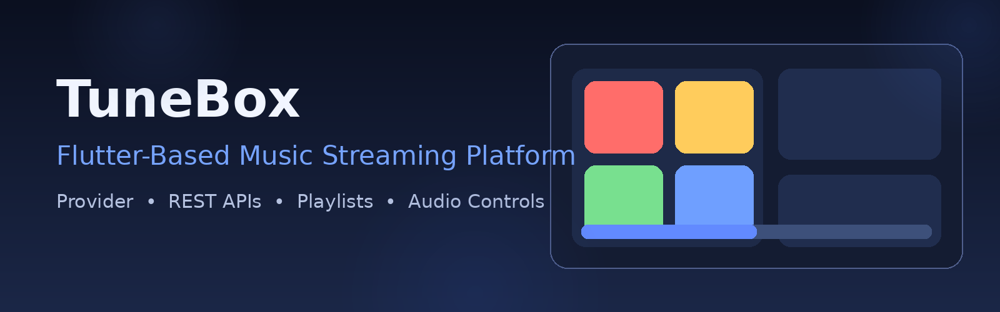
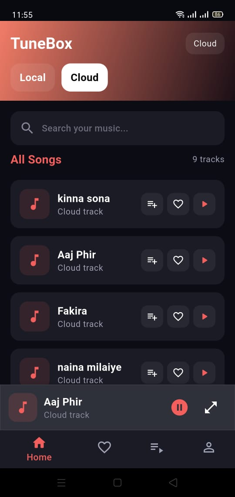
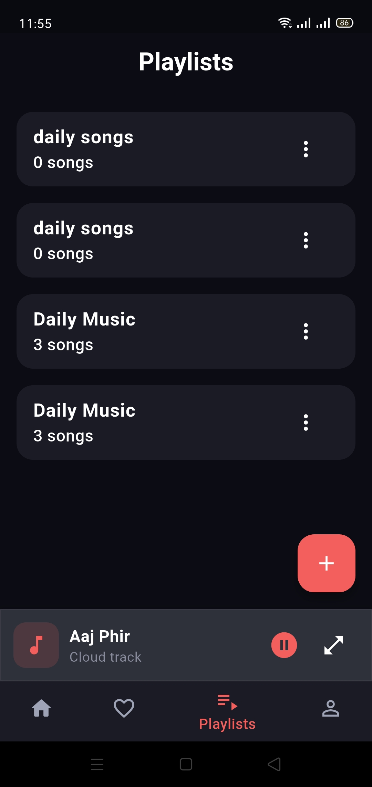
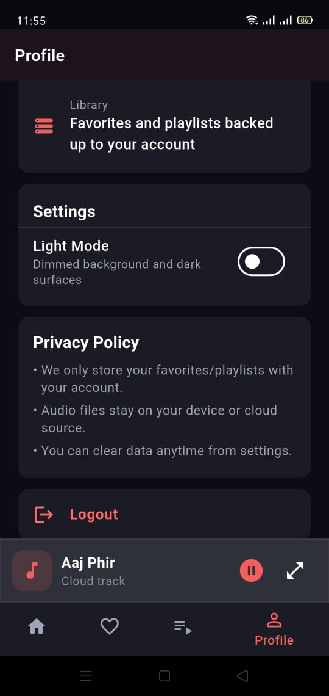
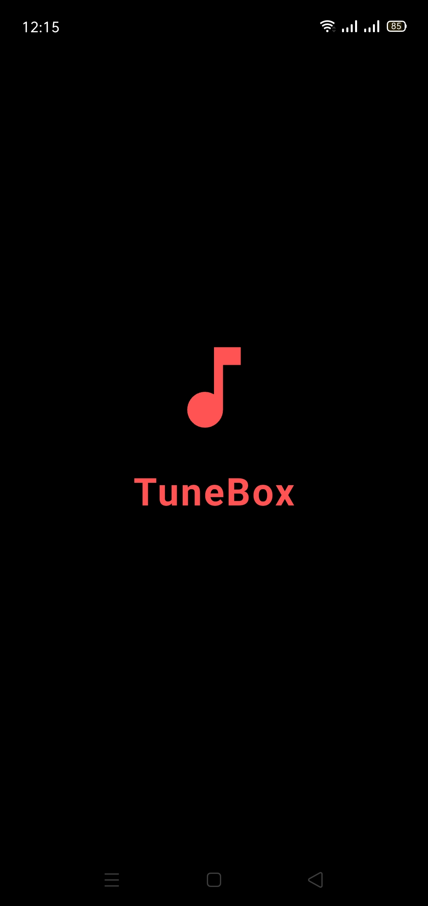
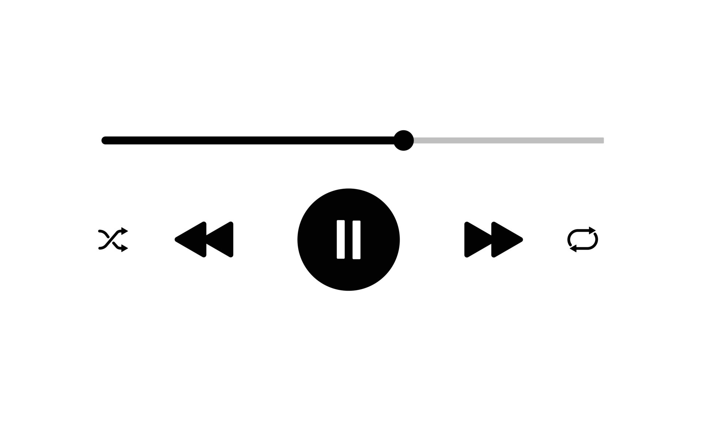

<p align="center">
  
</p>

# TuneBox

A production-oriented Flutter music streaming application that demonstrates scalable frontend architecture, reusable UI systems, and reliable REST API integration for real-world mobile product development.

## Project Overview

TuneBox is built to deliver a smooth listening experience with playlist workflows, responsive playback controls, and maintainable state-driven UI updates. The project emphasizes clean engineering practices and architecture that can grow with additional features.

## Features

- Playlist creation and management workflows
- Real-time audio playback controls (play, pause, skip, seek)
- REST API integration for user and music data
- Reusable component-based UI architecture
- Provider-based state management for predictable updates
- Rendering and playback reliability improvements

## Tech Stack

- **Framework:** Flutter
- **Language:** Dart
- **State Management:** Provider
- **Backend Integration:** REST APIs
- **API Validation & Testing:** Postman

## Architecture Highlights

- **Frontend Structure:** Modular screen/component organization for easier scaling and team collaboration
- **State Layer:** Provider controllers isolate business logic from presentation widgets
- **API Layer:** Service-oriented integration pattern with explicit error handling and graceful fallback states
- **Reusability:** Shared UI components reduce duplication and keep design behavior consistent

For a detailed breakdown, see [`docs/ARCHITECTURE.md`](docs/ARCHITECTURE.md).

## My Contributions

- Built reusable UI components for consistent and faster feature delivery
- Integrated REST APIs with proper error handling and UI-safe state updates
- Implemented Provider state management patterns across key flows
- Improved frontend architecture for scalability and maintainability
- Fixed rendering and playback issues impacting UX reliability
- Implemented playlist management and audio controls end-to-end

## Setup Instructions

1. **Clone the repository**
   ```bash
   git clone https://github.com/syedasjadabbas/TuneBox.git
   cd TuneBox
   ```
2. **Install dependencies**
   ```bash
   flutter pub get
   ```
3. **Configure backend services**
   - Follow [`SUPABASE_SETUP_INSTRUCTIONS.md`](SUPABASE_SETUP_INSTRUCTIONS.md)
   - Ensure Firebase/Supabase configuration files are present for your environment
4. **Run the app**
   ```bash
   flutter run
   ```

## Screenshots

### Home Screen
Landing experience with quick access to tracks, playlists, and recommendations.



### Player Screen
Focused playback surface with transport controls and track progress.



### Playlist Screen
Playlist-centric workflow for organizing and managing listening queues.



### Search Screen
Fast discovery flow for finding tracks and music content.



### Library Screen
Centralized library view for previously saved or managed content.



## Future Improvements

- Offline playback and smart caching for low-connectivity scenarios
- Enhanced recommendation workflows driven by user behavior insights
- Expanded analytics and observability for playback/session diagnostics
- CI/CD automation hardening for release confidence and faster iteration

## Repository Metadata

- **Description:** Flutter-based music streaming application featuring REST API integration, reusable UI components, playlist management, and scalable frontend architecture.
- **Suggested Topics:** `flutter`, `dart`, `music-streaming`, `rest-api`, `state-management`, `mobile-app`

## Author

**Syed Asjad Abbas**

- GitHub: [@syedasjadabbas](https://github.com/syedasjadabbas)
- Portfolio: [GitHub Projects](https://github.com/syedasjadabbas?tab=repositories)
